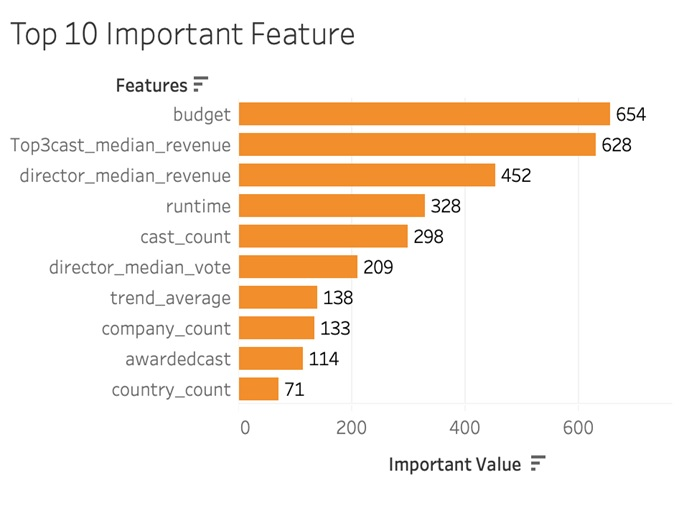

# Applied Machine Learning Group Project
## Project Idea: make  model to predict financial sucess of movie before its production
### Data
The main dataset includes 45K movies with the metadata and credits about the movie from 1920s to 2015
### Feature Importance

### Limitations
- Usable dataset size less than 5k, a lot of movies have 0 budget or 0 revenue
- Google trends data for each country is different, showing that some movies are searched more in certain countries
- No breakdown of box office revenue for each country and how much is spent on the cast or director
 
### Conclusion
Despite limitations we came up with decent classification model with **accuracy 89%** which can help movie producers and investors to make better informative decisions
