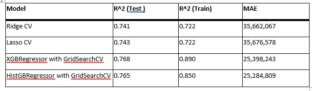
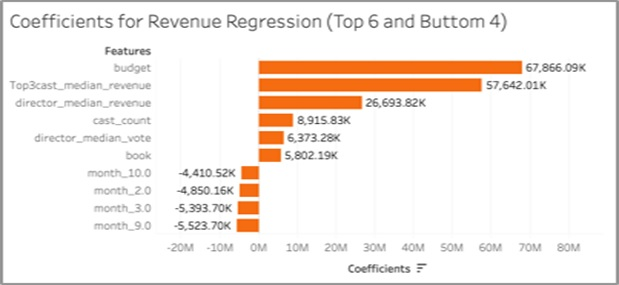
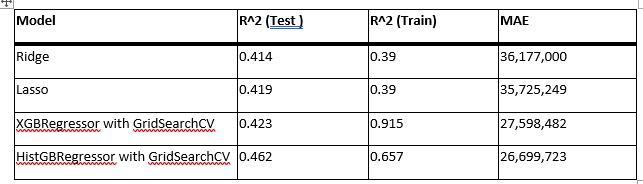
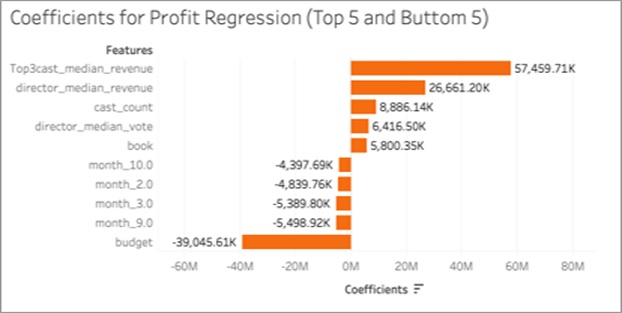
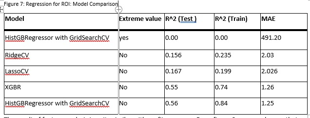
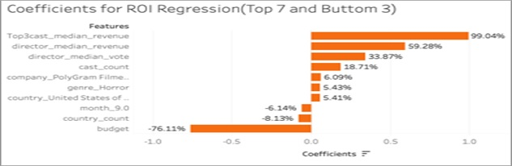
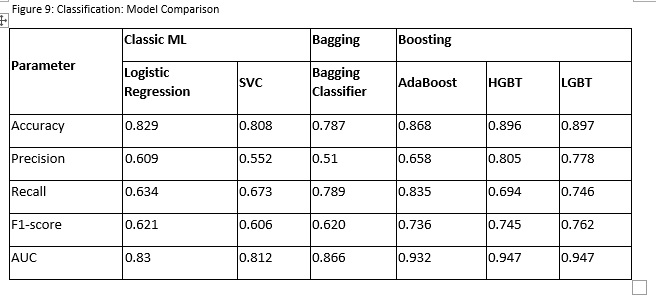
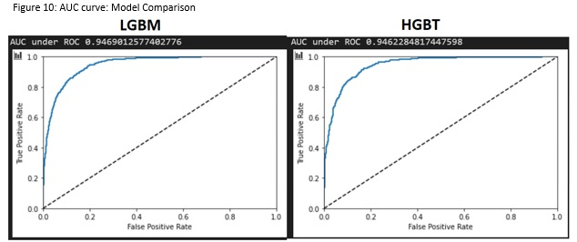

# Applied Machine Learning Group Project
## Project Idea: make model to predict financial success of movie before its production
### Intorduction
We hypothesize that movie revenues are closely associated only with a handful of variables i.e. budget, genre, movie runtime etc. If proven correct, we hope to distill the essence of these variables, enabling the producers and investors to understand and predict their movie revenues.
### Objective
Our objective is to come up with a model that could help movie producers and investors better arrive at informative investment decisions.
### Data
Four datasets would be used: 

- TMDB 45k Movie Dataset. The data set was obtained from Kaggle  and contain metadata for all 45,000 movies listed in the Full MovieLens Dataset. The dataset consists of movies released on or before July 2017. Data points include cast, crew, plot keywords, budget, revenue, posters, release dates, languages, production companies, countries, TMDB vote counts and vote averages. This dataset would be our primary source for revenue prediction.
- Google Trends Data. Audience’s researching activities on the movies are monitored via PyTrends API.  This data is scraped based on the movie title 150 days before the movie release to movie release day by using PyTrends API. The average of these 150 days index is used as one input for the analysis.
- Wikipedia Awarded Cast Data. List of actors with Academy Award nominations  is applied to add weights to the casts with awards.
- Movies based on novels and book Data. List of movies original from a novel or book  is applied to find its weights to revenue.
### Methodology
Of the 45,000 movies from the TMDB database, we have removed all movies with no revenue or budget data. Our final dataset that would be used for regression and classification purposes consists of the data we have gathered from 4 sources of datasets we mentioned earlier.
For revenue, profit and ROI, we tried various 4 methods of regression, namely Ridge, Lasso, Gradient Boosting Regressor and Hist Gradient Boosting Regressor. All predicting variables were standard scaled before they were passed into the models.

For classification, we have tried classic machine learning methods such as Logistic regression and SVC; we also used ensemble learning methods such as Bagging, Adaboost, HGBT and LGBT.
### Revenue-Regression results
The Lasso and Ridge linear regression models test and train R^2 yields very similar results, which indicate that overfitting is not an issue. We also tried 2 ensemble learning models XGBT and HGBT, where HGBT is similarly to LGBT built in Sk-learn.  However, from the results of the R^2, it indicates that the model has an overfitting issue.

According to figure 4 below, budget plays the most important factor in determining predicted revenue, followed by the median movie revenue of the top 3 cast.

### Profit-Regression results
Similar to the revenue model, the lasso and ridge linear regressors yield similar results. The XGBT and HGBT ensemble learning regressor models also yielded pretty similar results. The ensemble learning models also displayed overfitting issues for profit. However, the R^2 for all 4 models is in the 40 percent range.

Figure 6 shows the high negative coefficient awarded to budget shows that though budget positively affects revenue prediction, it has the opposite effect for profits, where it seems to negatively affect profits.

### ROI-Regression results
Our initial model that we ran gave us an R^2 of 0.00. However, we found that it was because of an outlier and after removing that outlier, subsequent regression results show that linear regression models such as Ridge and Lasso performs poorly compared to the ensemble learning models. Nevertheless, the model is still lacking and additional feature engineering or additional features would have to be added as the best test R^2 of 0.56 means that our model is only able to account for 56% of the variation, and is thus not satisfactory for the purpose of helping investors predict their ROI.

The result of feature analysis is quite similar with profit regressor. From figure 8, we can observe that the feature for horror genre is in the top ten features. This could indicate that many horror films are low-cost but have higher box office sales and thus returns a higher ROI than movies of other genres.

### Classification results
With our current features, we are only able to explain revenue to a satisfactory extent, as we are unable to come up with models that can predict profits and ROI, we have classified a movie to be successful if its box office revenue reaches or exceeds 300% of the movie’s budget. This 300% of budget mark signifies the breakeven point after lessing off all the profit sharing, distribution fees and taxes.
Definition of movie success: 1*(1-0.033-0.05)(1-0.1)(1-0.6) = 0.33
Based on Figure 9, we can see that the LGBT and HGBT are the two models which have the highest accuracy precision, recall, F1-score and AUCs.

Based on Figure 10, we can see that LGBT is the slightly better model to use as the AUC under the ROC for LGBT model is slightly higher for the LGBT model.

From Figure 11, we observe that the top 3 features for revenue regression, which are budget, top3 cast median revenue and director median revenue are also the 3 most important features when classifying whether the movie is a success or a failure. The length of the movie (runtime), number of casts (cast_count), director popularity(director_median_vote), how often the movie gets searched 150 days before release date(trend_average), number of production companies (company_count), whether any of the cast has received an award before(awardedcast), and number of countries the movie has been released in(country_count) are the top 10 most important features for the LGBT classification model.

### Limitations and Future Work
- The key limitation of our dataset is the size of available data which can be used for analysis. Though we started off with a dataset of 45k movies, most of them do not have revenue and budget information, which are used to calculate ROI, revenue and profit and thus cannot be used for our dataset.

- The second limitation is the lack of breakdown in the cost of the movie (how much is spent on the actor, director, cast, scriptwriter) which could help us to determine whether more money spent in whichever areas would lead to better revenue or profit outcomes. 
- The third limitation is the lack of breakdown of box office revenue by country. As such details were not given, more meaningful information cannot be collected. For example, google trends data for every country can be collected, but since box office revenue by country is not provided, we are unable to determine whether increased searches on google for the movie would lead to increased box office revenue in that particular country holds true. With country box office revenue breakdown, we can also examine whether the original language of the movie (other than English) would enjoy more sales in countries where most people do use that language.
- In the future, if more detailed breakdown information is provided we could come out with a model with more accuracy by using better feature selection.

 
### Conclusion
Even though the amount of information we have is not enough to construct enough features that would produce meaningful predictions from a regression model for profit and ROI (theoretically, our features cannot make us accurate enough prediction results, no matter what kind of the model we choose). By simplifying the decision task to a classification problem, we are able to come up with a model that allows us to be able to successfully identify whether a movie would at least break even or not with relatively high accuracy **89%**. The model as it is right now can be a great help for specified stakeholders. 
