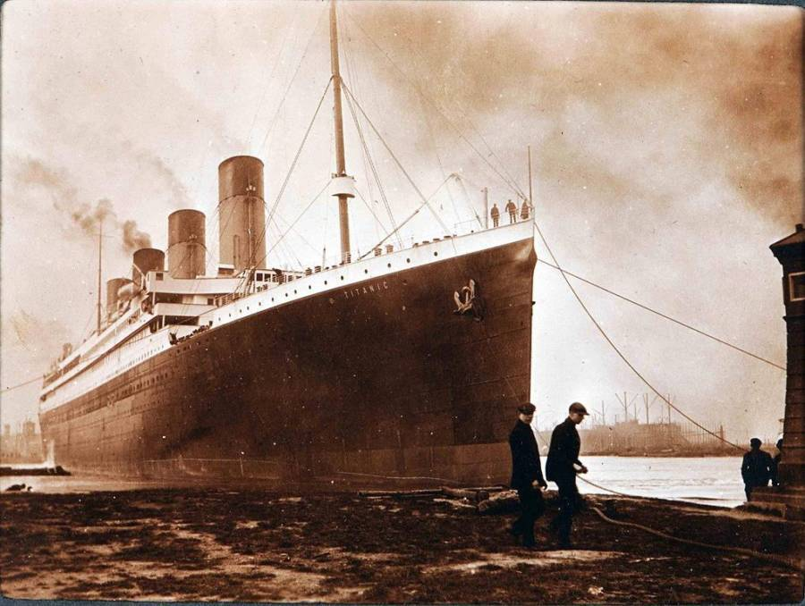
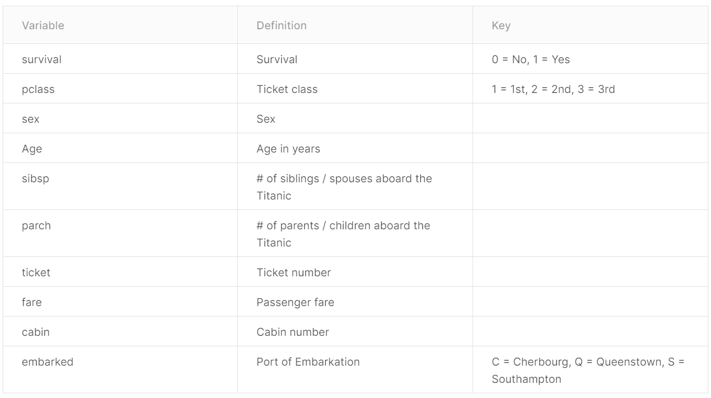

# Purpose of Visualisation

The sinking of the Titanic is one of the most infamous shipwrecks in history, due to large scale of causalities and publicity this catastrophe got. The main goal is to show how different features affected **survivability**.



## The Titanic Data Dictionary.


# Visualisation Step-by Step

## Load Libraries
```{r}
library(tidyverse)
library(alluvial)
```
Tidyverse is a set of libraries for data upload/cleaning/wrangling/visualisation.  
Alluvial is a library for Alluvial diagram which is a variant of a Parallel Coordinates Plot (PCP) but for categorical variables.

## Data upload
```{r}
df = read_csv("titanic.csv")
show(df)
```

## Missing Values

First lets be mindfull of data restrictions we may have. As can be seen above we have missing values in our data lets check what they are.

Total number of missing values
```{r}
sum(is.na(df))
```
Missing values by columns
```{r}

df %>% summarise(
  Survived = sum(is.na(Survived)),
  Pclass = sum(is.na(Pclass)),
  Name = sum(is.na(Name)),
  Sex = sum(is.na(Sex)),
  Age = sum(is.na(Age)),
  SibSp = sum(is.na(SibSp)),
  Fare = sum(is.na(Fare)),
  Cabin = sum(is.na(Cabin)),
  Embarked = sum(is.na(Embarked))
)
```

Lets replace misisng values in Age columns with median
```{r}
df = df %>% 
  mutate_at(vars(Age), ~ifelse(is.na(.), median(., na.rm = TRUE), .))

df %>% summarise(
  Age = sum(is.na(Age))
)
```

For graphs purposses lets make sex values in capital letters.
```{r}
df$Sex[df$Sex == "female"] = "Female"
df$Sex[df$Sex == "male"] = "Male"
```


## Deaths/Survived

```{r}
ggplot(data = df, aes(x = factor(Survived))) + geom_bar(stat = "count", color = c("red","blue"), fill = "white")+
  geom_text(stat='count', aes(label=..count..), vjust=c(14,9), color=c("red","blue"), size=6)+
  annotate(geom="text", x=1.00, y = 225, label="Dead",
              color="red", size = 6)+
  annotate(geom="text", x=2.00, y = 125, label="Survived",
              color="blue", size = 6)+
  theme_void()
```

As can be seen from the graph more than half of passengers had died during shipwrecked.

## Age/Survived

```{r}
ggplot(data = df, aes(x=Age, color = factor(Survived)))+
  geom_histogram(aes(y=..density..),fill="white", bins = 40)+
  geom_density(alpha=.2, fill="#FF6666")+
  facet_grid(~Survived)+
  theme_minimal()
  
```

One intake we can have from this one is that kids below 10 years old seemed to have higher chances to survive than other age groups.

## Sex/Survived

```{r}
ggplot(data = df, aes(x = factor(Survived), fill = Sex)) + geom_bar(stat = "count")+
  geom_text(aes(label=..count..),stat="count",position=position_stack(0.5), color = "white", size = 5) +
  scale_fill_manual("Sex", values = c("Female" = "deeppink", "Male" = "#56B4E9")) +
  annotate(geom="text", x=1.00, y = 215, label="Dead",color="white", size = 5)+
  annotate(geom="text", x=1.00, y = 490, label="Dead",color="white", size = 5)+
  annotate(geom="text", x=2.00, y = 35, label="Survived",color="white", size = 5)+
  annotate(geom="text", x=2.00, y = 205, label="Survived",color="white", size = 5)+
  theme_void()
```

Chance for a male to survive = 109/(468 + 109) = **19%**.

Chance for a female to survive = 233/(233 + 81) = **74%**.

Female was **3.7 times**  more likley to survive than male.

## Pclass ordinal scale

Pclass has ordinal scale, and we need to check the order of values.
```{r}
ggplot(data = df, aes(y = Fare, x = factor(Pclass))) + geom_point() + theme_minimal()
```

From graph we can infer that **1 > 2 > 3**, it will help us understand better either or not there is any relation of surviability with Pclass.

## Pclass/Survived

```{r}
ggplot(data = df, aes(x = factor(Survived), fill = factor(Pclass))) + geom_bar(stat = "count") +
  geom_text(aes(label=..count..),stat="count",position=position_stack(0.5), color = "white", size = 5) +
  scale_fill_manual("Pclass", values = c("1" = "gold", "2" = "slategray2", "3" = "tan2"))+
  annotate(geom="text", x=1.00, y = 490, label="Dead",color="white", size = 5)+
  annotate(geom="text", x=1.00, y = 400, label="Dead",color="white", size = 5)+
  annotate(geom="text", x=1.00, y = 165, label="Dead",color="white", size = 5)+
  annotate(geom="text", x=2.00, y = 250, label="Survived",color="white", size = 5)+
  annotate(geom="text", x=2.00, y = 140, label="Survived",color="white", size = 5)+
  annotate(geom="text", x=2.00, y = 30, label="Survived",color="white", size = 5)+
  theme_void()
  
```

Chance for a first class ticket passenger to survive = 136/(136+80) = **63%**

Chance for a second class ticket passenger to survive = 87/(97+87) = **47%**

Chance for a third class ticket passenger to survive = 119/(372+119) = **24%**

As we can see that having higher class ticket affects survivability drasticly.

## Sex/Pclass/Survived
```{r}
ggplot(data = df, aes(x = factor(Survived), fill = factor(Pclass))) + geom_bar(stat = "count") + facet_grid(~Sex)+
  geom_text(aes(label=ifelse(..count.. < 10, "",..count..)),stat="count",position=position_stack(0.5), color = "white", size = 5) +
  scale_fill_manual("Pclass", values = c("1" = "gold", "2" = "slategray2", "3" = "tan2")) +
  annotate(geom="text", x=1.00, y = 500, label="Dead",color="Red", size = 5)+
  annotate(geom="text", x=2.00, y = 500, label="Survived",color="Blue", size = 5)+
  theme_void()
```

For a female:

* Chance for a first class ticket passenger to survive = 91/(91+3) =  **97%**

* Chance for a second class ticket passenger to survive = 70/(6+70) **92%**

* Chance for a third class ticket passenger to survive = 72/(72+72) = **50%**

For a male:

* Chance for a first class ticket passenger to survive = 45/(77+45) = **37%**

* Chance for a second class ticket passenger to survive = 17/(91+17) = **16%**

* Chance for a third class ticket passenger to survive = 47/(47+300) = **13.5%** 


## Alluvial Plot

```{r}
# Prepare data for alluvial plot
tab = read.csv("Cross_tab.csv")
colnames(tab) = c("Pclass","Survived","Sex","Freq")
tab = tab[c("Pclass","Sex","Survived","Freq")]
colnames(tab)
```

```{r}
alluvial( tab[,1:3], freq=tab$Freq, border=NA,
         hide = tab$Freq < quantile(tab$Freq, .0001),
         col=ifelse( tab$Survived == "No", "red", "blue") )
```

The Alluvial Diagramm give us summarized picture of what we have observed in graphs above, but in one comprehensive picture. 


# Conclusion

Through the EDA we drill down to the two main factor wich affect survivability in titanic catastrophe **Sex** and **Ticket Class**.

* Overall *Female* had **3.7 times** higher chances to survive than *Male*.

* Holder of *First Class Ticket* had **2.6 times** higher chances to survive than Holder of *Third Class Ticket*.

* When we look at those features combined it turnes out that the worst chances of surviability for a *Female* was by having *Third Class Ticket* **50%** and much better chances above **90%** for *First and Second Class Tickets*, but **50%** chance is still much higher than **37%** chance for *Male* who is also *First Ticket Class Holder* and **3.7** times higher than those *Male* with *Third Class Tickets*.


